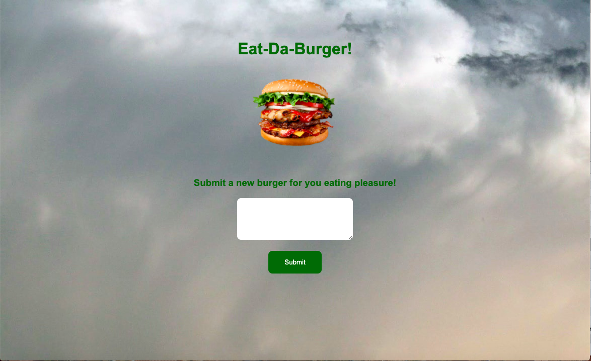

# burger-up


## Table of Contents
* [Description](#description)
* [Installation](#installation)
* [Technologies Used](#technologies-used)
* [Application Demo](#application-demo)
* [Contact Information](#contact-information)

## Description
Eat-Da-Burger! is a restaurant app that lets users input the names of burgers they'd like to eat. Whenever a user submits a burger's name, your app will display the burger on the left side of the page -- waiting to be devoured. Each burger in the waiting area also has a Devour it! button. When the user clicks it, the burger will move to the right side of the page.

## Installation
This application is deployed on Heroku. To use this application, you must install the following:
* Express npm package: ```npm install express```
* Handlebars npm package: ```npm install express-handlebars```
* MySQL npm package: ```npm install mysql```

And run: ```node server.js```

## Technologies Used
HTML, CSS, JavaScript, Express, Node JS, MySQL, Handlebars

## Application Demo


## Contact Information
* Masiel Bautista
  * GitHub Profile: https://github.com/masielb